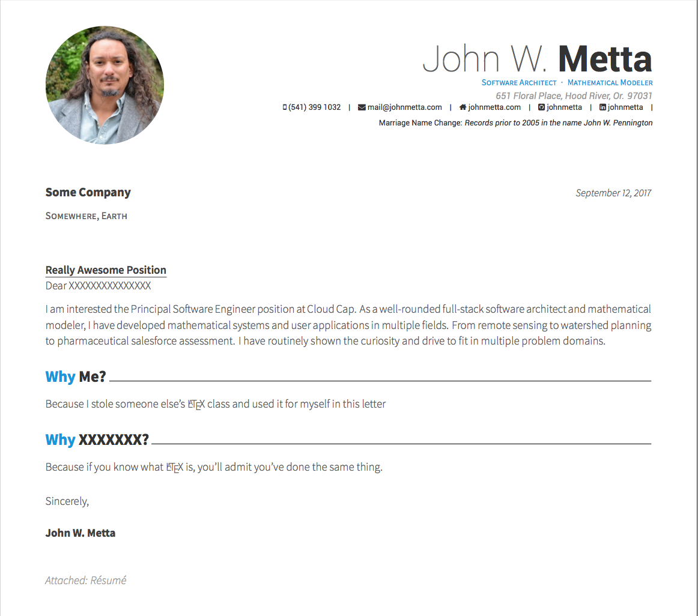
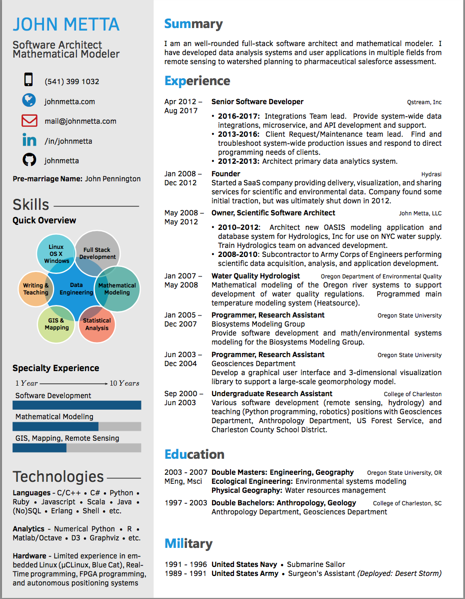

# LaTeX resume template

This is the template I use for my own resume. It was originally a fork of
[Harshavardhan Gadgil's Data Engineer Resume](opensorceror/Data-Engineer-Resume-LaTeX),
but I pulled it into a non-forked repository when I added the modified cover
letter from [Claud D. Park's Awesome CV](https://github.com/posquit0/Awesome-CV).

## Screenshots





## Notes

Needs LuaLaTex or XeLaTex to compile.

## License

```
Copyright 2016 Harshavardhan Gadgil

Licensed under the Apache License, Version 2.0 (the "License");
you may not use this file except in compliance with the License.
You may obtain a copy of the License at

   http://www.apache.org/licenses/LICENSE-2.0

Unless required by applicable law or agreed to in writing, software
distributed under the License is distributed on an "AS IS" BASIS,
WITHOUT WARRANTIES OR CONDITIONS OF ANY KIND, either express or implied.
See the License for the specific language governing permissions and
limitations under the License.
```
